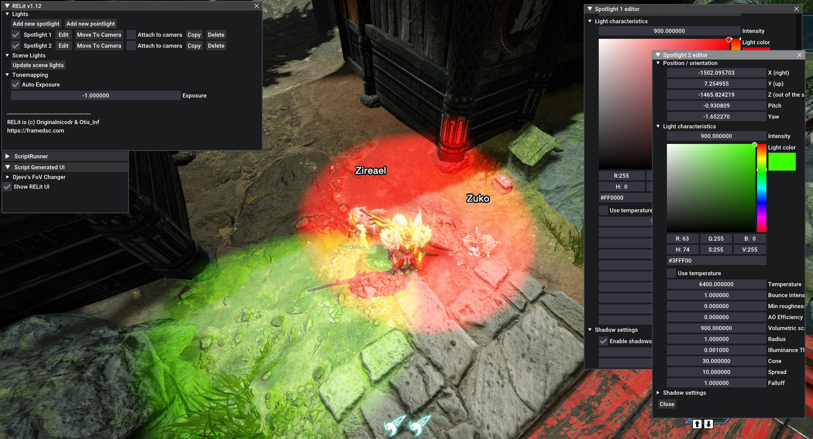
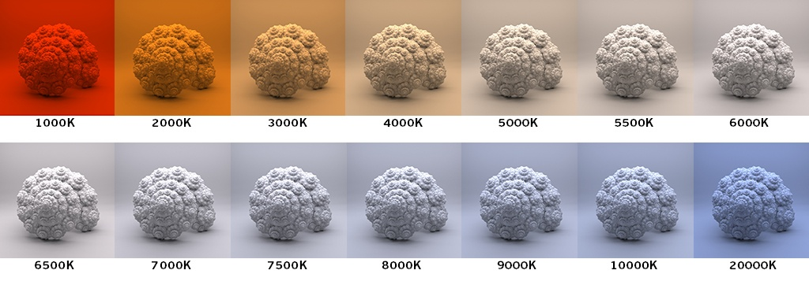
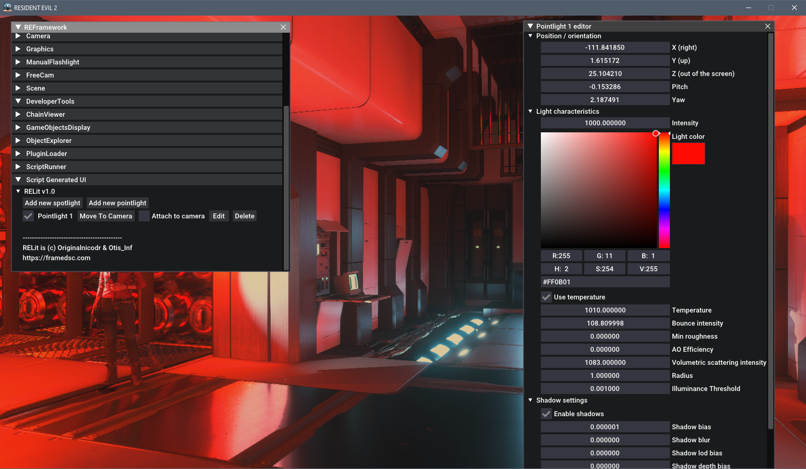

# RELit

---

**NOTE**: You're not allowed to re-host this mod anywhere else, be it Nexus or your own site or on some discord or whatever else you can come up with. 

RELit is a powerful tool to create spotlight and pointlights in RE powered games. Please read the requirements and how to install it.

RELit was written by [Originalnicodr](https://github.com/originalnicodr) and [Otis_inf](https://github.com/FransBouma).

Special thanks go to [alphaZomega](https://github.com/alphazolam) for the assistance and [praydog](https://github.com/praydog) for REFramework.

At the time of writing the supported games are *Devil May Cry 5*, *Monster Hunter Rise*, *Resident Evil 2 Remake*, *Resident Evil 3 Remake*, *Resident Evil 7* and *Resident Evil Village*, but we would expect future Capcom games that run on the RE Engine and are supported by REFramework to work as well.

## Requirements
RELit depends on the REFramework by praydog. You need to download the REFramework version for your game, [here](https://github.com/praydog/REFramework-nightly/releases) (currently using the nightly builds, for a stable version go [here](https://github.com/praydog/REFramework/releases)). Go to the latest release and then click the .zip file for the game you want to use RELit with. 
For more information about REFramework, visit [the project repository](https://github.com/praydog/REFramework).

## Installation
Please visit the [Releases](https://github.com/originalnicodr/RELit/releases) to get the latest release. 

After downloading the REFramework zip for your game, unpack that zip into a folder. Then copy *only* the `dinput8.dll` file and place
it in the game's folder, where the exe is. So e.g. in the case of DMC5, you download the DMC5.zip from the REFramework releases, 
unpack it into a folder, and then copy the `dinput8.dll` file to the DMC5 game folder, which is `<steam folder>\common\Devil May Cry 5`

After you've installed the REFramework dll (the `dinput8.dll`), you can install the RELit mod into the game folder. 
Simply copy the reframework folder from the RELit zip into the game's folder (the same one into which you placed the `dinput8.dll`).

## Configuring RELit and REFramework
The default key to open the REFramework gui is the `Insert` key. If you use the Otis_Inf cameras you'd like to rebind this key in REFramework
to another key, e.g. scroll lock. When the REFramework GUI is open, go to configuration and rebind the menu key there, by clicking `Menu key`
and then press the key you want to use, e.g. scroll lock, to open the REFramework gui.

When the REFramework GUI is open, click on `Script Generated UI`, and you'll see the `Show RELit UI` checkbox. Checking it will open the 
RELit window. It has an initial width and height, you can resize it which will be remembered for the next sessions.

After you've opened the RELit GUI, you can create lights, manage scene lights and use the tonemapper features.

## Creating lights
In the RELit GUI, click open `Lights` to create custom lights. To create a light, click on the `Add new spotlight` or `Add new pointlight` buttons to create 
a light of that type. The light is created at the position of the camera. To edit light characteristics, click on the `Edit` button next to the light in the 
list of lights, which appears after creating a light. To delete a light, click on the `Delete` button.

You can also disable the light by clicking the checkbox next to its name.

The lights can also be moved to the camera position again by clicking `Move to camera`, or be tied to the camera by checking the `Attach to camera` checkbox.

You can also copy a light's property into another light by clicking the `Copy` button.

## Managing scene lights
When you click to open the `Scene Lights` header, you can obtain the current scene lights by clicking the `Update scene lights` button. After you've done that
you can switch the currently switched on lights off with the new `Switch off scene lights` button. After you've done that you have to switch the lights
back on with the `Switch scene lights back on` button before you can obtain the scene lights again. 

Do take in mind that, at least the way we manage to make this work for now, if you turn off the lights and turn them on again, their intensity will increase.

Also, not all emitting lights are lights we can control. So the elements that are left that emit lights are elements that are other elements than lights and we can't control them being switched on/off, sadly.

## Tonemapping
To work with lights in a more consistent way you can turn off the Auto exposure and edit it yourself by going to the `Tonemapping` section in RELit and using the relevant setting there.

# **Documentation**

The following information was based on the lights documentation on [Cyberpunk 2077](https://framedsc.com/GeneralGuides/cyberlit.htm), [UUU4 documentation](https://opm.fransbouma.com/uuuv4.htm#lights) and [UE4 documentation](https://docs.unrealengine.com/4.27/en-US/BuildingWorlds/LightingAndShadows/LightMobility/DynamicLights/) and also inferred with trial and error. If you notice something wrongly explained in this readme please hit us up!

# Light Types

### **Point lights**
Radiate light in all directions from a single point in 3D space. It's best used for environmental lighting due to its omnidirectionality.

### **Spot lights**
Shoot a cone of light in a specified direction, also from a single point in 3D space. This is best used for lighting portraits, as it can be aimed at certain parts of a face.

# Light Properties

## Color picker / RGB / HSV / Hex
Allows you to select the color of the light by changing the RGB, HSV, or HEX values, or by using the fancy color picker.

## Temperature
This adds to any set of colors with a color that corresponds to the temperature of an ideal black-body radiator. In other words, you can set warm and cool lights with this. Represented in Kelvin, you can mimic sunlight, candlelight, and various other natural lights with this setting.

*From [docs.arnoldrenderer.com](https://docs.arnoldrenderer.com/display/A5AFMUG/Lights)*

## Intensity
This controls how bright the light is.

## Radius
This controls how far the light can travel, likely in in-game meters. Keep in mind that, for the light to be able to render farther it will increase its "intensity" closer to the origin (like a real-life light would do).

## Falloff - Spotlight only
This slider controls how far in the world the light will affect geometry and models. The higher the value the more will be lit by the light.

## Min roughness
The minimal roughness value that a material can have when the light is shining on it. In proper English, it means that, if the value is low (close to or is 0), the material can be shiny if it's shiny as the minimal roughness is very low. If you set it to a higher value, if the material's minimal roughness is 0 (so it's shiny) it will still be matte / less shiny because you set the minimal roughness of the light to a higher value. This effectively can be used to reduce shininess of a light on material, (e.g. wet skin) by increasing the min roughness value.

## Spread - Spotlight only
This controls the softness of the light relative to the outer angle, in degrees. Anything within the inner cone will be evenly lit while the light gradually falls off closer to the outer cone. Setting the inner angle to be equal or greater than the outer angle creates a spotlight with hard edges.

## Cone - Spotlight only
This controls how wide the whole cone of light is, in degrees.

## Bounce intensity
How much will the light bounce from environments and NPCs.

## AO Efficiency
It introduces extra ambient occlusion shadowing based on the light if you increase the value.

## Volumetric Scattering Intensity

This is the amount the light affects the fog that's in the world. It might be this option doesn't do anything, because there's no fog volume in the game at the light's location.

# Shadow Properties

## Enable shadows

This checkbox toggles shadow rendering of the light. Off means no shadows at all.

## Shadow Bias
At 0, shadows will start at their caster surface but there will be many self-shadowing artifacts. With larger values, shadows will start further from their caster and there won't be self-shadowing artifacts but the object might appear to fly or float above a surface.

In general, if the light is close to the object that's shadowed, setting this to a lower value gives sharper shadows and no banding. Altho this appears to be a modifier of fade distance too?

## Shadow Blur
It's actually "Shadow Variance". Using a value of 0 will give you very defined shadows, but sometimes some shadows can be very blocky (especially with self-shadow casting), and introducing a bit of "variance" could help.

## Shadow lod bias

## Shadow Depth Bias
It means how far should the light cast shadows.

## Shadow Slope Bias
Works in addition to Shadow Depth Bias in controlling how accurate self-shadowing of whole scene shadows from this light is. It works by increasing the amount of bias depending on the slope of a given surface.

## Shadow Near Bias
It means how near should the light cast shadows.

## Detail shadow - Spotlight only

# Extra tips

- Sometimes a spotlight will stop rendering when moving it around or modifying some of its values (or it might not even be rendered when first created). This looks to be an engine error, and the only workaround we have found so far is to move the light or its parameters just slightly until it gets rendered.

- Not seeing any shadows when creating a spotlight it's likely due to the Shadow near plane value being too low/wrong. Go into the light editor and increase the Shadow near plane value to a higher value till you see the shadows appear and they look OK.

- If you see big stripes in the shadows when creating a light, it might be due to the default shadow bias. To correct these stripes, increase (or decrease) the shadow bias values till they're gone. 

- As with other imgui-based applications, you can move sliders slower or faster by pressing `Control` or `Alt` respectively when moving them. You can also edit the value of the slider itself with `Control` + `Mouse Click`, even outside of the slider boundaries. We recommend you to stick to these, but since we are still experimenting with these values (and every game might behave around them differently) feel free to experiment.

- Altho it might not cause problems, it would be a good idea to delete spawned lights once they are not needed anymore to avoid making the game run into unpredicted behavior.